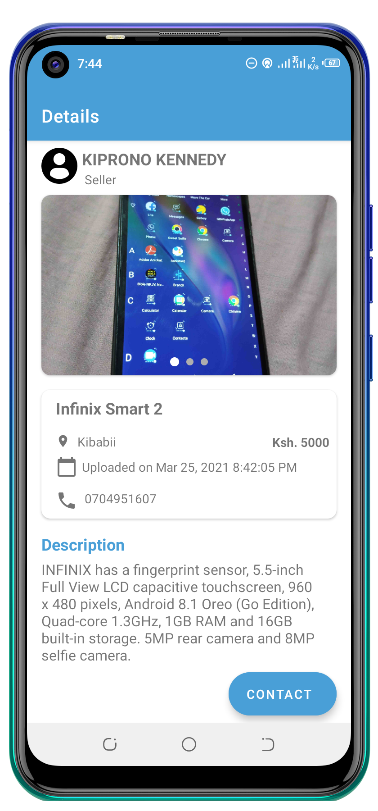

<p align="center">


# KIBU-OLX

An android application to help students of Kibabii University in buying cheap items at an affordable price, also they can sell those items at their comfort zones by just a click of a button. 🚲 🛏️🖥️💻📱⌨️🪑🍻🪣👕👖👔👞👟🧤🧢👜💼🎒🧳🗑️📗🍴🍽️🔪

Min Api Level : 21 


## Table of Contents


- [Getting Started](#run)
- [Libraries](#libraries)
- [Demo](#demo)
- [Contributors](#contributors)
- [Support](#support)
- [References](#references)


## Setup Requirements

- Android device or emulator
- Android Studio

## Getting Started

In order to get the app running yourself, you need to:

1.  Clone this project
2.  Import the project into Android Studio
3.  Connect the android device with USB or just use your emulator
4.  In Android Studio, click on the "Run" button.

## Libraries

Libraries used in the whole application are:

- [Firebase Authentication](https://firebase.google.com/docs/auth) - provides backend services, easy-to-use SDKs, and ready-made UI libraries to authenticate users to your app.
- [Firebase Realtime Database](https://firebase.google.com/docs/database) - Store and sync data with our NoSQL cloud database. Data is synced across all clients in realtime, and remains available when your app goes offline.
- [Firebase Storage](https://firebase.google.com/docs/storage) - Cloud Storage for Firebase is built for app developers who need to store and serve user-generated content, such as photos or videos.
- [Glide](https://github.com/bumptech/glide) - a fast and efficient open source media management and image loading framework for Android that wraps media decoding, memory and disk caching, and resource pooling into a simple and easy to use interface.
- [Room](https://developer.android.com/training/data-storage/room) - Provides abstraction layer over SQLite
- [Material Design](https://material.io/develop/android/docs/getting-started/) - build awesome beautiful UIs.🔥🔥
- [Livedata](https://developer.android.com/topic/libraries/architecture/livedata) - an observable data holder class
- [ViewModel](https://developer.android.com/topic/libraries/architecture/viewmodel) - a class is designed to store and manage UI-related data in a lifecycle conscious way
- [Navigation Components](https://developer.android.com/guide/navigation) - Navigation component helps you implement navigation, from simple button clicks to more complex patterns, such as app bars and the navigation drawer
- [Timber](https://github.com/JakeWharton/timber) - a logger with a small, extensible API which provides utility on top of Android's normal Log class.

## Demo

### Splash Screen and Authentication

<p float="left">

  
  
  </p>
  
### Home, Favorites and Settings 
<p>
  
  
  
</p>

### Item Details
<p>
  
   
   
</p>

### Sell Item
<p>
  
  
</p>
  
  ## Dark Mode

<p float="left">


  
  
  
  
  
  </p>

## Contributors

- Thanks to [Coding in Flow](https://codinginflow.com/) for amazing tutorial on the MVVM and android architectural components

## Support

- Found this project useful ❤️? Support by clicking the ⭐️ button on the upper right of this page. ✌️
- Notice anything else missing? File an issue 
- Feel free to contribute in any way to the project from typos in docs to code review are all welcome.

## References

- https://material.io/develop/android/components/navigation-view/
- https://codinginflow.com/
- https://developer.android.com/
- https://firebase.google.com/docs

## License

 ```
   Copyright 2021 iFixHubKE
   
   Licensed under the Apache License, Version 2.0 (the "License");
   you may not use this file except in compliance with the License.
   You may obtain a copy of the License at

       http://www.apache.org/licenses/LICENSE-2.0

   Unless required by applicable law or agreed to in writing, software
   distributed under the License is distributed on an "AS IS" BASIS,
   WITHOUT WARRANTIES OR CONDITIONS OF ANY KIND, either express or implied.
   See the License for the specific language governing permissions and
   limitations under the License.
