<p align="center">

  
# KIBU-OLX

An android application to help students of Kibabii University in buying cheap items at an affordable price, also they can sell those items at their comfort zones by just a click of a button. 🚲 🛏️ 🖥️ 💻 📱 ⌨️ 🪑 🍻 🪣 👕 👖 👔 👞 👟 🧤 🧢 👜 💼 🎒 🧳 🗑️ 📗 🍴 🍽️ 🔪


Min Api Level : 21 [Supports Over 87% Devices ](https://developer.android.com/about/dashboards)

Build System : [Gradle](https://gradle.org/)

[![PlayStore][playstore-image]][playstore-url]

[playstore-image]: https://github.com/DSC-Kibabii-University/KIBU-OLX/blob/master/screenshots/google-play-badge.png


[playstore-url]: https://play.google.com/store/apps/details?id=com.ifixhubke.kibu_olx


## Table of Contents

- [Libraries](#libraries)
- [Demo](#demo)
- [Support](#support)
- [References](#references)


## Setup Requirements

- Android device or emulator
- Android Studio

## Getting Started

In order to get the app running yourself, you need to:

1.  Clone this project
2.  Import the project into Android Studio
3.  Sync the project and make sure you rebuild the project to make sure it has downloaded all required libraries and dependecies
4.  Connect the android device with USB or just use your emulator
5.  In Android Studio, click on the "Run" button.

## Libraries

Libraries used in the whole application are:

- [Firebase Authentication](https://firebase.google.com/docs/auth) - provides backend services, easy-to-use SDKs, and ready-made UI libraries to authenticate users to your app.
- [Firebase Realtime Database](https://firebase.google.com/docs/database) - Store and sync data with our NoSQL cloud database. Data is synced across all clients in realtime, and remains available when your app goes offline.
- [Firebase Storage](https://firebase.google.com/docs/storage) - Cloud Storage for Firebase is built for app developers who need to store and serve user-generated content, such as photos or videos.
- [Glide](https://github.com/bumptech/glide) - a fast and efficient open source media management and image loading framework for Android that wraps media decoding, memory and disk caching, and resource pooling into a simple and easy to use interface.
- [Room](https://developer.android.com/training/data-storage/room) - Provides abstraction layer over SQLite
- [Material Design](https://material.io/develop/android/docs/getting-started/) - build awesome beautiful UIs.🔥🔥
- [Livedata](https://developer.android.com/topic/libraries/architecture/livedata) - an observable data holder class
- [ViewModel](https://developer.android.com/topic/libraries/architecture/viewmodel) - a class is designed to store and manage UI-related data in a lifecycle conscious way
- [Navigation Components](https://developer.android.com/guide/navigation) - Navigation component helps you implement navigation, from simple button clicks to more complex patterns, such as app bars and the navigation drawer
- [Timber](https://github.com/JakeWharton/timber) - a logger with a small, extensible API which provides utility on top of Android's normal Log class.
- [Palette](https://developer.android.com/training/material/palette-colors) - A Palette object gives you access to the primary colors in an image, as well as the corresponding colors for overlaid text.

## Demo

### OnBoarding Screens

<p>
  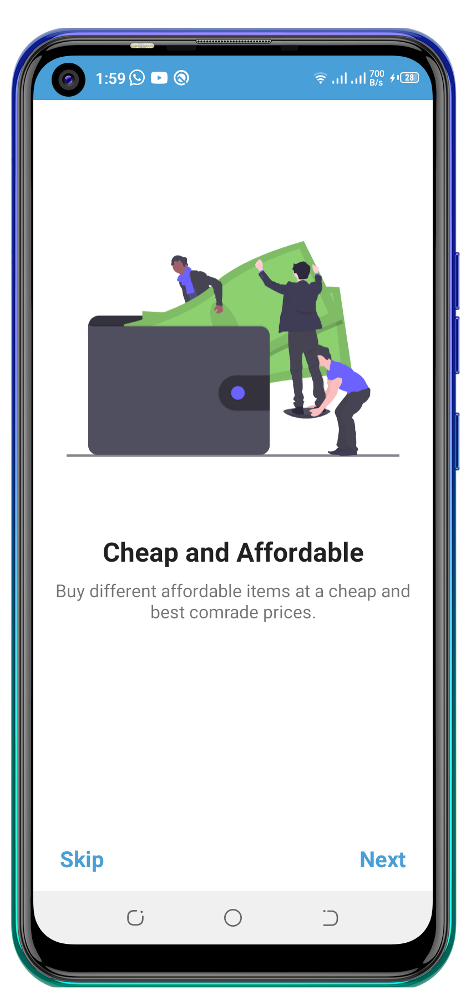
  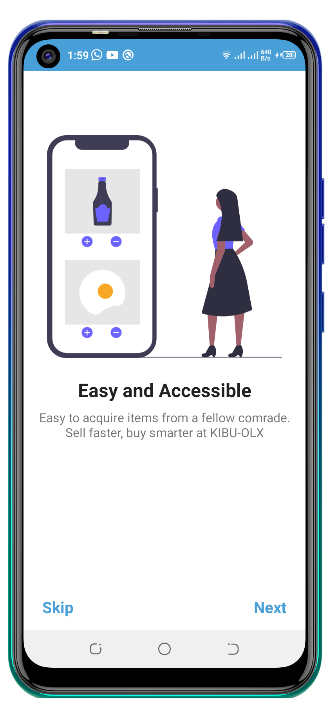
  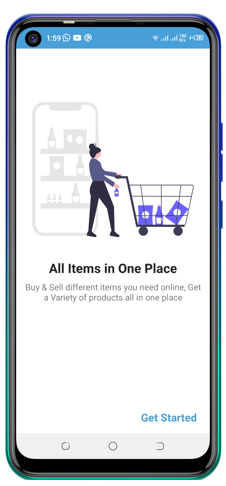
</p>

### Splash Screen and Authentication

<p float="left">
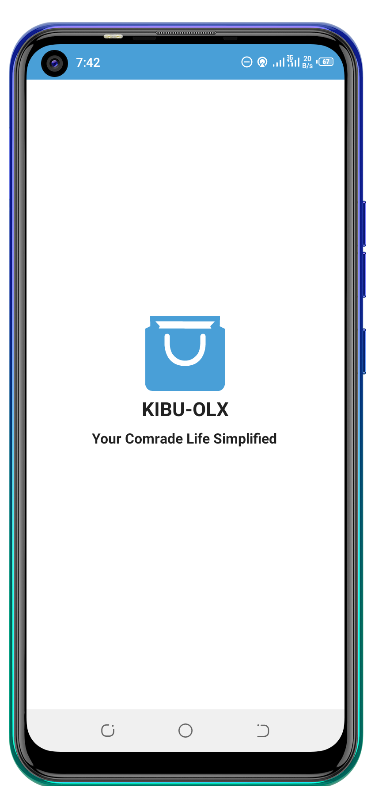
  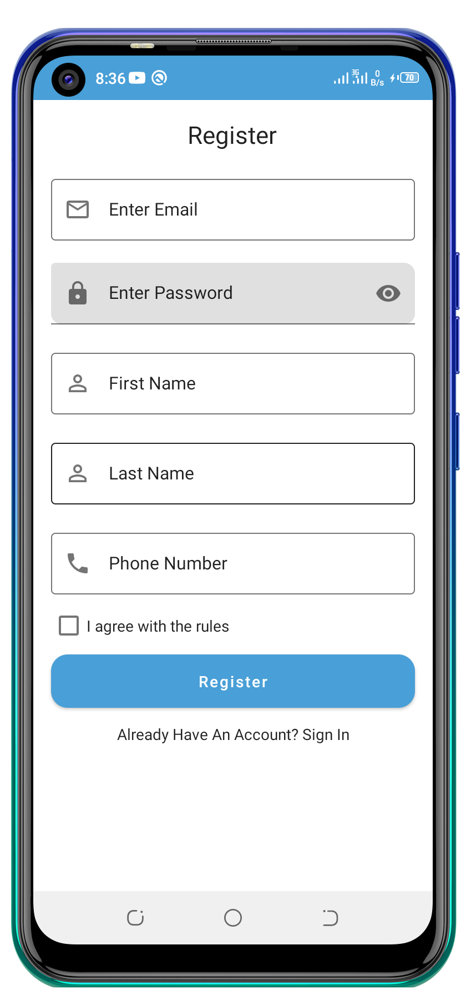
  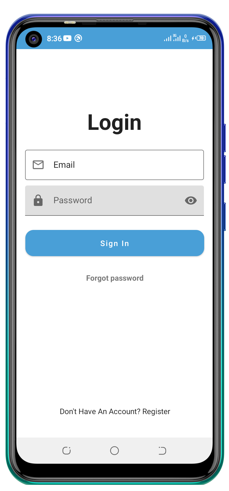
  </p>
  
### Home, Favorites and Settings 
<p>
  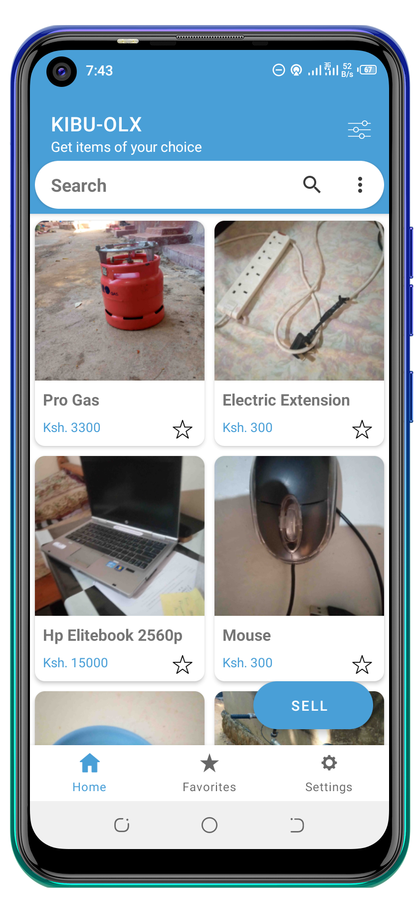
  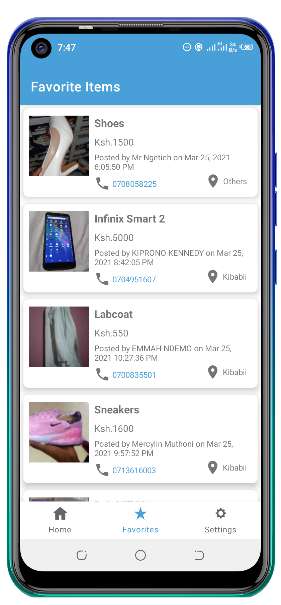
  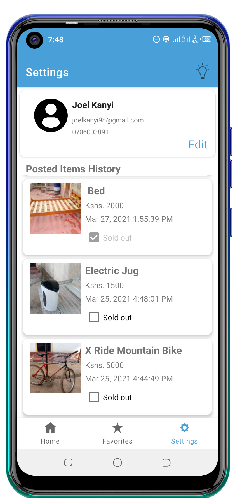
</p>

### Item Details
<p>
  
   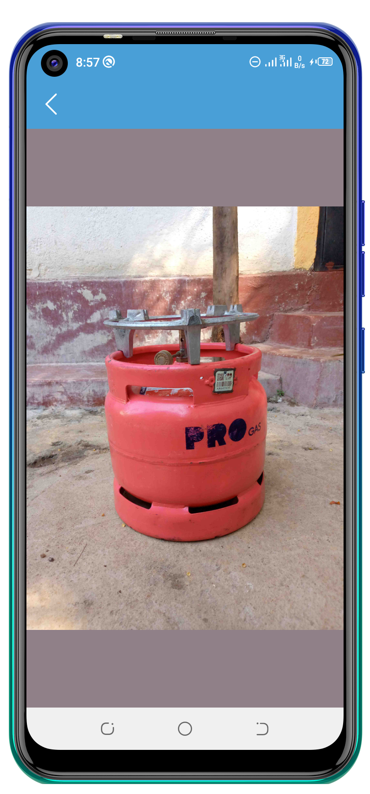
   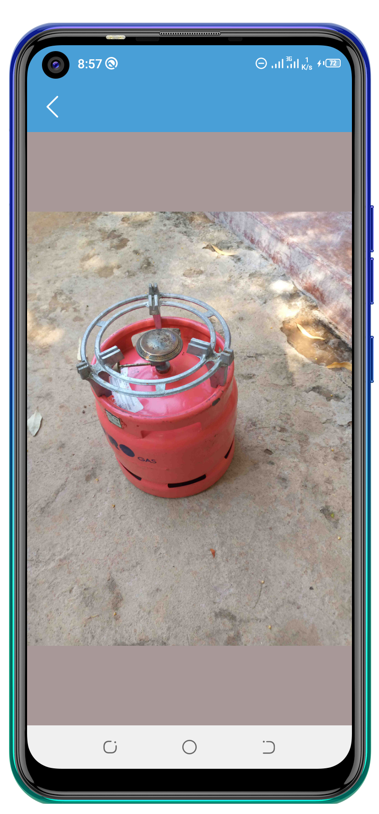
</p>

### Sell Item
<p>
  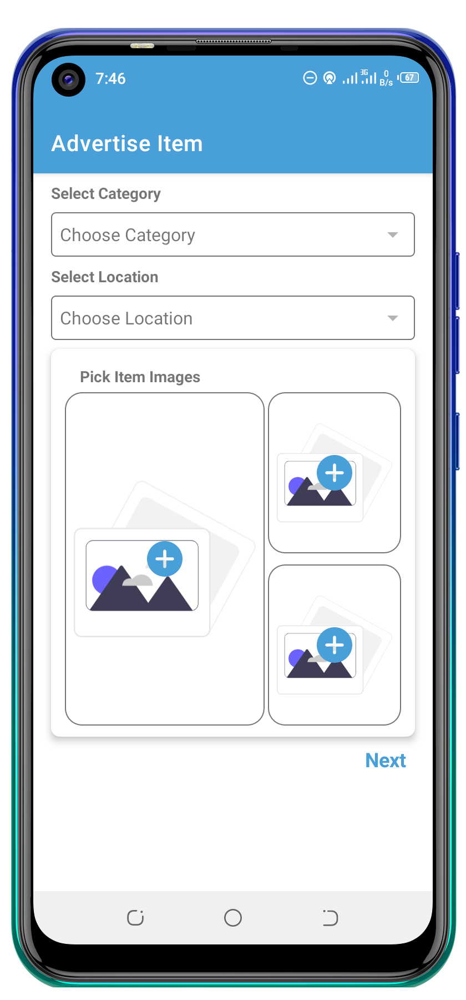
  
</p>
  
  ## Dark Mode

<p float="left">
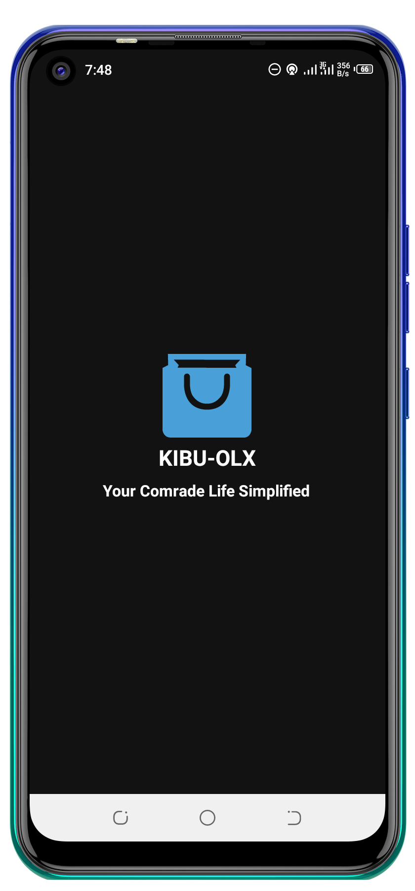
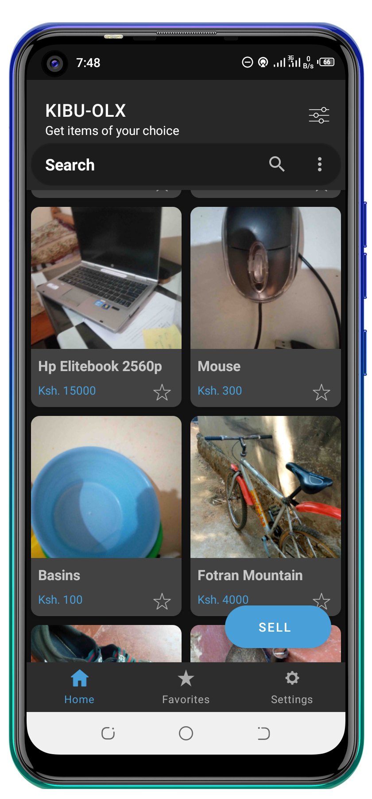
  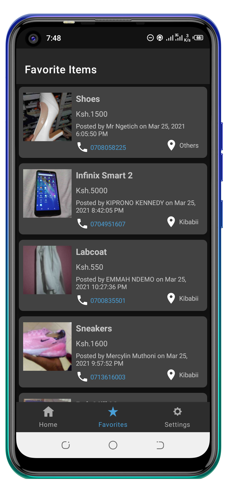
  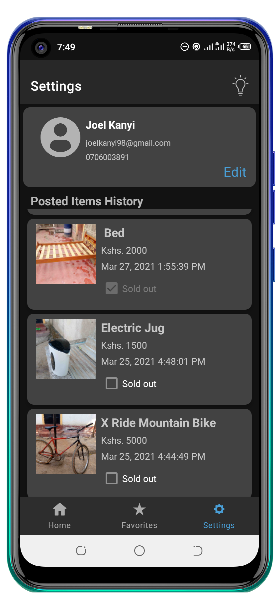
  </p>

## Support

- Found this project useful ❤️? Support by clicking the ⭐️ button on the upper right of this page. ✌️


## Contributing

- Please fork this repository and contribute back using pull requests.
- Any contributions, large or small, major features, bug fixes, are welcomed and appreciated but will be thoroughly reviewed .
- Notice anything else missing? File an issue 

## References

- https://material.io/develop/android/components/navigation-view/
- https://codinginflow.com/
- https://developer.android.com/
- https://firebase.google.com/docs
- https://developer.android.com/guide/navigation

## License

 ```
   Copyright 2021 iFixHubKE
   
                       GNU GENERAL PUBLIC LICENSE
                       Version 3, 29 June 2007

 Copyright (C) 2007 Free Software Foundation, Inc. <https://fsf.org/>
 Everyone is permitted to copy and distribute verbatim copies
 of this license document, but changing it is not allowed.
